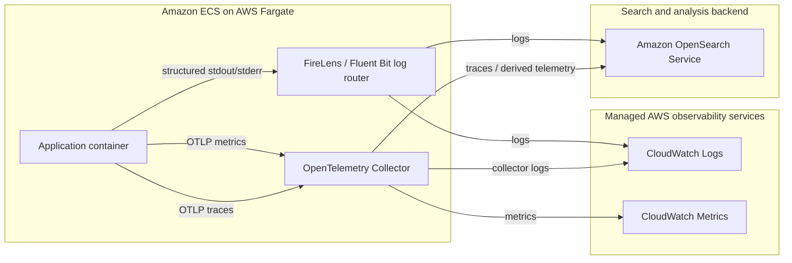

# Telemetry Architecture

This diagram shows the intended high-level telemetry flow for an ECS Fargate workload. The repository contains reference patterns and placeholder values; production implementations should confirm networking, authentication, encryption, retention, and capacity requirements.

## Signal paths

### Logs

1. The application writes structured logs to `stdout` and `stderr`.
2. FireLens or Fluent Bit receives the container log stream.
3. Logs can be delivered to CloudWatch Logs for operational retention and to OpenSearch for search and analysis.

### Metrics

1. The application or runtime exports metrics using OpenTelemetry Protocol (OTLP).
2. The OpenTelemetry Collector receives, processes, and batches the metrics.
3. Metrics are exported to an approved backend such as CloudWatch Metrics.

### Traces

1. Instrumented application components export spans over OTLP.
2. The OpenTelemetry Collector applies configured processing and sampling.
3. Traces are sent to an OpenSearch-compatible observability backend or another approved tracing service.

## Security and reliability boundaries

- Application containers should not contain long-lived observability credentials.
- ECS task roles should grant only the write permissions required by each telemetry destination.
- Sensitive values and regulated data should be removed or redacted before export.
- Collector queues, retry behaviour, and resource limits should be tested so telemetry failures do not destabilise the application.
- Network paths to managed services should use encrypted connections and approved private connectivity where required.

See the [logging strategy](logging-strategy.md), [metrics and traces guide](metrics-and-traces.md), and [sensitive telemetry handling guide](sensitive-telemetry-handling.md) for implementation details.